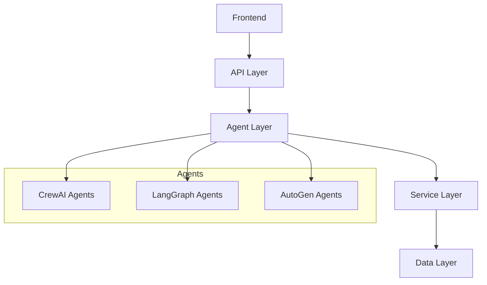

<div align="center">

# 🤖 AgenticAI Portfolio

### Production-Grade Multi-Agent AI Systems Implementation

[Features](#features) • [Projects](#projects) • [Architecture](#architecture) • [Installation](#installation) • [Contributing](#contributing)


[](https://www.python.org/downloads/)
[](https://docs.crewai.com/)
[](https://python.langchain.com/docs/langgraph)
[](https://microsoft.github.io/autogen/)
[](https://github.com/psf/black)
[](https://opensource.org/licenses/MIT)

---

## 🎯 Portfolio Overview

A comprehensive showcase of Multi-Agent AI Systems expertise demonstrating production-grade implementations across multiple frameworks. This portfolio highlights advanced software engineering practices, distributed systems architecture, and practical AI applications.

### 🔑 Key Features

- Production-ready Multi-Agent Systems
- Enterprise-grade Architecture
- Comprehensive Testing Suite
- Advanced Error Handling
- Scalable Design Patterns

### 🔄 CrewAI Projects

<details>
<summary><b>📊 MultiAgentContentCreation</b></summary>

- Financial content generation pipeline
- Market analysis automation
- Multi-agent collaboration:
  - Market News Monitor
  - Data Analyst
  - Content Creator
  - Quality Assurance
- Groq LLama 3.1 70B integration
</details>

<details>
<summary><b>🤝 MultiAgentCustomerOutreach</b></summary>

- B2B sales process automation
- Lead qualification system
- Specialized agents:
  - Sales Representative
  - Lead Sales Representative
  - Intelligent engagement strategies
- Hugging Face Transformers for sentiment analysis
</details>

<details>
<summary><b>💬 MultiAgentCustomerSupportAutomation</b></summary>

- Enterprise-grade support automation
- Documentation integration
- Core components:
  - Support Agent
  - QA Agent
  - DocumentScraper
- Conversation Memory
- User Feedback Loops
- Fallback/Escalation Options
</details>

<details>
<summary><b>📋 MultiAgentProjectAutomation</b></summary>

- Project management automation
- Resource allocation optimization
- Key agents:
  - Project Planning Agent
  - Estimation Agent
  - Resource Allocation Agent
  - Scheduler Agent with Gantt integration
</details>

<details>
<summary><b>🔍 MultiAgentResearchSystem</b></summary>

- Research automation platform
- Content generation system
- Agent structure:
  - Planning Agent
  - Writing Agent
  - Editing Agent
- FAISS-based vector database
</details>

### 📝 LangGraph Implementation

<details>
<summary><b>AgenticEssayWriter</b></summary>

- Advanced essay generation system
- Multi-step reasoning pipeline
- Components:
  - Planning Agent
  - Research Agent
  - Writing Agent
  - Critique Agent
</details>

### 📈 AutoGen Implementation

<details>
<summary><b>FinancialAnalysisAndCoding</b></summary>

- Automated financial analysis
- Stock market data processing
- Features:
  - Real-time data fetching
  - Automated visualization
  - Multi-agent code generation
  - Dockerized code execution
  - Plugin-based AnalysisAgent
  - Automated periodic analysis
</details>

### 🔧 From Scratch Implementation

<details>
<summary><b>FromScratchProject</b></summary>

- Basic project structure
- Placeholder implementation
- Custom agentic AI system development
</details>

## 🏗 Technical Architecture



### Project Structure
```
src/
├── agents/          # AI Agent implementations
│   ├── crew/       # CrewAI specific agents
│   ├── lang/       # LangGraph agents
│   └── auto/       # AutoGen agents
├── models/          # Data models & validation
├── services/        # External integrations
├── utils/           # Shared utilities
├── config/          # Configuration management
└── tests/           # Comprehensive testing
```

### 🔩 Key Technical Features

- **Agent Architecture**: Modular design, state management, error handling
- **Data Processing**: Type safety (Pydantic), validation, async processing
- **Testing Infrastructure**: Unit/integration tests, mocks, CI/CD ready

## 💻 Technologies

<details>
<summary><b>Core Stack</b></summary>

- **Frameworks**: CrewAI, LangGraph, AutoGen, Langchain
- **Backend**: Python 3.8+, FastAPI, Pydantic, AsyncIO
- **Data**: Pandas, NumPy, yfinance, BeautifulSoup4
- **DevTools**: pytest, mypy, black, flake8
</details>

## 🚀 Getting Started

1. **Clone the Repository**
```bash
git clone https://github.com/YanCotta/AgenticAIPortfolio.git
cd AgenticAIPortfolio
```

2. **Set Up Environment**
```bash
python -m venv venv
source venv/bin/activate  # On Windows: venv\Scripts\activate
pip install -r requirements.txt
```

3. **Configure Environment Variables**
```bash
cp .env.example .env
# Edit .env with your credentials
```

4. **Run Tests**
```bash
pytest tests/
```

## 🔬 Development Practices

- Clean Architecture
- SOLID Principles
- Type Safety
- Error Handling
- Async Programming
- Testing Best Practices
- Documentation Standards
- Configuration Management

## 📊 Project Overview Matrix

| Project | Framework | Complexity | Key Features | Use Case |
|---------|-----------|------------|--------------|-----------|
| MultiAgentContentCreation | CrewAI | ⭐⭐⭐⭐ | Market Analysis, Groq LLama Integration | Content Generation |
| MultiAgentCustomerOutreach | CrewAI | ⭐⭐⭐ | Lead Qualification, Sentiment Analysis | B2B Sales |
| MultiAgentCustomerSupport | CrewAI | ⭐⭐⭐⭐ | Support Automation, Memory Management | Customer Service |
| MultiAgentProjectAutomation | CrewAI | ⭐⭐⭐ | Resource Planning, Scheduler Agent | Project Management |
| MultiAgentResearchSystem | CrewAI | ⭐⭐⭐ | Research Automation, FAISS Vector DB | Content Creation |
| AgenticEssayWriter | LangGraph | ⭐⭐⭐ | Essay Generation | Content Creation |
| FinancialAnalysisAndCoding | AutoGen | ⭐⭐⭐ | Market Analysis, Dockerized Execution | Financial Services |
| FromScratchProject | None | ⭐ | Basic Structure | Custom Development |

## 🤝 Contributing

We welcome contributions! Please follow these steps:

1. Fork the repository
2. Create a feature branch (`git checkout -b feature/AmazingFeature`)
3. Commit your changes (`git commit -m 'Add some AmazingFeature'`)
4. Push to the branch (`git push origin feature/AmazingFeature`)
5. Open a Pull Request

Please ensure your PR adheres to our [Contributing Guidelines](CONTRIBUTING.md).

## 📝 License

This project is licensed under the MIT License - see the [LICENSE](LICENSE) file for details.

---

<div align="center">

**[⬆ back to top](#agenticai-portfolio)**

Built with ❤️ by [Yan Cotta](https://github.com/YanCotta)

</div>

