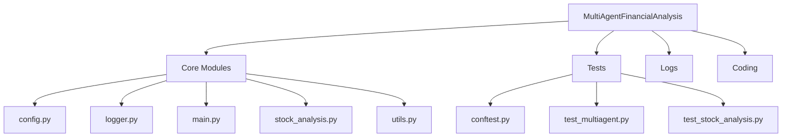

<div align="center">

# 📊 Automated Financial Analysis Using AutoGen Multi-Agent System

[](https://www.python.org/downloads/)
[](https://microsoft.github.io/autogen/)
[](https://opensource.org/licenses/MIT)
[](https://github.com/psf/black)

*A sophisticated multi-agent system for automated financial analysis powered by Microsoft AutoGen*

[Overview](#project-overview) • [Architecture](#technical-architecture) • [Installation](#installation--setup) • [Usage](#usage-examples) • [Testing](#testing)

</div>

---

## 🎯 Project Overview

This project demonstrates the implementation of a sophisticated multi-agent system using Microsoft's AutoGen framework to perform automated financial analysis. The system leverages multiple AI agents to collaboratively analyze stock market data, specifically focusing on NVIDIA (NVDA) and Tesla (TSLA) stocks, and generates insightful visualizations.

## 🏗️ Technical Architecture

### 🤖 Core Components

<details>
<summary><strong>1. Multi-Agent System</strong></summary>

- 🔧 Code Executor Agent: Handles code execution and environment interactions **(Dockerized)**
- ✍️ Code Writer Agent: Generates and optimizes analysis code
- 📊 **Analysis Agent: Performs advanced stock analysis using plugins**
- 🔄 Both agents communicate via AutoGen's conversation protocols
- ⏰ **Scheduler: Automates periodic analysis and report generation**

</details>

<details>
<summary><strong>2. Key Modules</strong></summary>

| Module | Description |
|--------|-------------|
| `stock_analysis.py` | Core financial data processing and visualization |
| `config.py` | Agent configuration and system settings management |
| `main.py` | Orchestration and workflow management |
| `logger.py` | Comprehensive logging system using Loguru |
| `utils.py` | Environmental configuration and utility functions |

</details>

<details>
<summary><strong>3. Testing Infrastructure</strong></summary>

- ✅ Comprehensive test suite using pytest
- 🔄 Mock implementations for external services
- 📊 Coverage for both unit and integration tests

</details>

## 📋 Technical Requirements

### System Requirements
```
• Python 3.9+
• Git
• Unix-based OS (recommended)
• Windows (supported)
```

### Dependencies
<details>
<summary>Click to expand</summary>

| Package | Purpose |
|---------|----------|
| AutoGen | Multi-agent orchestration |
| yfinance | Financial data retrieval |
| pandas | Data manipulation |
| matplotlib | Data visualization |
| python-dotenv | Environment management |
| pydantic | Data validation |
| loguru | Advanced logging |

</details>

## 🚀 Installation & Setup

1. **Clone Repository**
   ```bash
   git clone <repository_url>
   cd AgenticAIPortfolio/AutoGen/FinancialAnalysisAndCoding
   ```

2. **Virtual Environment Setup**
   ```bash
   python -m venv venv
   source venv/bin/activate  # Unix-based systems
   # or
   venv\Scripts\activate     # Windows
   ```

3. **Install Dependencies**
   ```bash
   pip install -e .
   pip install -r requirements.txt
   ```

4. **Environment Configuration**
   ```bash
   # Create .env file with:
   OPENAI_API_KEY=your_api_key_here
   ```

## 📁 Project Structure



## 🔧 Implementation Details

### Agent Configuration
- Utilizes AutoGen's ConversableAgent and AssistantAgent
- Custom code executor configuration for secure code execution **using Docker**
- **AnalysisAgent with plugin architecture for incorporating additional factors**
- Robust error handling and logging

### Financial Analysis Features
- Real-time stock data retrieval
- YTD price analysis for NVDA and TSLA
- Automated visualization generation
- Comparative stock performance analysis

### Data Visualization
- Stock price trends
- YTD gains comparison
- Interactive matplotlib plots
- Automated save functionality

## 💻 Usage Examples

<details>
<summary><strong>Quick Start Guide</strong></summary>

1. **Basic Usage**
   ```bash
   python -m MultiAgentFinancialAnalysis.main
   ```

2. **Scheduled Usage**
   ```bash
   python -m MultiAgentFinancialAnalysis.scheduler
   ```

3. **Output**
   - Generates two visualization files:
     - `ytd_stock_gains.png`: Year-to-Date gains comparison
     - `stock_prices_YTD_plot.png`: Price trend analysis
   - **Reports are saved to the `reports/` directory with timestamps**

</details>

## 🧪 Testing

```bash
# Run all tests with progress bar
pytest -v --progress-bar=on

# Run with coverage report
pytest --cov=MultiAgentFinancialAnalysis --cov-report=html
```

## 🔍 Error Handling & Logging

<details>
<summary><strong>Comprehensive Error Management</strong></summary>

The system implements comprehensive error handling for:
- API authentication failures
- Data retrieval issues
- File I/O operations
- Agent communication errors

Logs are:
- Automatically rotated at 10MB
- Retained for one week
- Compressed for storage efficiency
- Thread-safe for concurrent operations

</details>

## 🚀 Future Enhancements

| Category | Planned Features |
|----------|-----------------|
| Analysis | Additional financial indicators, Extended historical analysis |
| Portfolio | Portfolio optimization, Real-time market alerts |
| Technical | Enhanced visualization, **Expanded plugin ecosystem** |
| Security | Improved containerization |
| Operations | **Configurable scheduling intervals** |

## 📄 License

This project is licensed under the MIT License - see the [LICENSE](LICENSE) file for details.

---

<div align="center">

Made with ❤️ using [AutoGen](https://microsoft.github.io/autogen/)

</div>