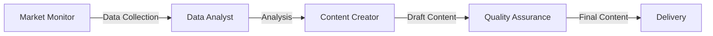

# 🤖 Multi-Agent Financial Content Creation System

[](https://www.python.org/downloads/)
[](https://github.com/joaomdmoura/crewAI)
[](https://opensource.org/licenses/MIT)

> A sophisticated AI-powered content generation pipeline leveraging multiple specialized agents for high-quality financial content and market analysis.

## 📑 Table of Contents
- [🎯 Project Overview](#-project-overview)
- [🏗 Architecture](#-architecture)
- [🛠 Technical Stack](#-technical-stack)
- [📦 Project Structure](#-project-structure)
- [🔧 Installation](#-installation)
- [💻 Usage](#-usage)
- [🔍 Key Features](#-key-features)
- [🔄 Workflow](#-workflow)
- [🚀 Production Considerations](#-production-considerations)
- [📚 Development](#-development)
- [🤝 Contributing](#-contributing)
- [📝 License](#-license)

## 🎯 Project Overview

This system demonstrates advanced implementation of multi-agent collaboration for automated content creation, specifically focused on financial market analysis and content distribution. It showcases the practical application of:

- Multi-agent systems architecture
- Natural Language Processing
- Financial data analysis
- Automated content generation
- Quality assurance automation
- Social media integration

## 🏗 Architecture

### Agent Ecosystem
<table>
<tr>
<td width="25%">

**🔍 Market News Monitor**
- Real-time monitoring
- SerperDev integration
- Web scraping tools
</td>
<td width="25%">

**📊 Data Analyst**
- Market data processing
- Trend analysis
- Opportunity identification
</td>
<td width="25%">

**✍️ Content Creator**
- Content generation
- Platform optimization
- SEO implementation
</td>
<td width="25%">

**✅ Quality Assurance**
- Accuracy verification
- Technical validation
- Brand consistency
</td>
</tr>
</table>

## 🛠 Technical Stack

### Core Technologies
- 🤖 **CrewAI Framework** - Agent orchestration
- 🧠 **Language Models**
  ```
  ├── OpenAI GPT-4
  └── Groq LLama 3.1 70B
  ```
- 🔧 **Tools & Integration**
  ```
  ├── SerperDevTool
  ├── ScrapeWebsiteTool
  └── WebsiteSearchTool
  ```

### Development Stack
- 📝 Pydantic - Data validation
- ⚙️ YAML - Configuration
- 📊 Python logging

## 📦 Project Structure

```
MultiAgentContentCreation/
├── src/
│   ├── agents.py       # Agent definitions and crew assembly
│   ├── main.py         # Application entry point
│   ├── models.py       # Pydantic data models
│   └── helper.py       # Utility functions
├── config/
│   ├── agents.yaml     # Agent configuration
│   └── tasks.yaml      # Task definitions
└── requirements.txt    # Dependencies
```

## 🔧 Installation

<details>
<summary>📥 Step-by-step setup guide</summary>

1. Clone the repository:

2. Set up a virtual environment:
```bash
python -m venv venv
source venv/bin/activate  # Windows: venv\Scripts\activate
```

3. Install dependencies:
```bash
pip install -r requirements.txt
```

4. Configure environment variables:
```bash
# Create .env file with:
OPENAI_API_KEY=your_openai_api_key
SERPER_API_KEY=your_serper_api_key
GROQ_API_KEY=your_groq_api_key  # Optional
```

</details>

## 💻 Usage

<details>
<summary>🚀 Getting started</summary>

1. **Basic Execution**:
```bash
python src/main.py
```

2. **Output Format**:
- Markdown-formatted financial articles
- Platform-optimized social media posts
- Market analysis reports
- Quality assurance reports

</details>

## 🔍 Key Features

<details open>
<summary>💡 Feature Overview</summary>

### Agent Configuration
- YAML-based configuration for easy modification
- Specialized roles and goals for each agent
- Configurable task dependencies
- Flexible tool integration

### Data Models
- Structured content validation
- Type-safe data handling
- Standardized output formats

### Error Handling
- Comprehensive logging
- Environment validation
- Result verification
- Exception management

### Content Generation
- Multi-platform content adaptation
- SEO optimization
- Brand voice consistency
- Quality assurance automation

</details>

## 🔄 Workflow



1. Market News Monitor Agent gathers financial data
2. Data Analyst Agent processes and analyzes information
3. Content Creator Agent generates targeted content
4. Quality Assurance Agent validates and refines output
5. System delivers formatted content and social media posts

## 🚀 Production Considerations

- Implement rate limiting for API calls
- Add caching for frequently accessed data
- Set up monitoring and alerting
- Configure backup and recovery procedures
- Implement CI/CD pipeline

## 📚 Development

### Technical Expertise
```
├── Multi-agent Systems
├── Python Development
├── API Integration
├── NLP Processing
├── Financial Analysis
├── Architecture Design
├── Error Management
└── Config Management
```

This project demonstrates expertise in:
- Multi-agent system design
- Advanced Python programming
- API integration
- Natural Language Processing
- Financial data analysis
- Software architecture
- Error handling and logging
- Configuration management

## 🤝 Contributing

1. Fork the repository
2. Create a feature branch
3. Implement changes with tests
4. Submit a pull request with documentation

## 📝 License

This project is licensed under the MIT License.

---
<div align="center">
Built with ❤️ using CrewAI Framework
</div>