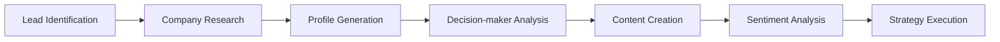

# MultiAgent Customer Outreach System 🤖

[](https://www.python.org/downloads/)
[](https://github.com/joaomdmoura/crewAI)
[](https://opensource.org/licenses/MIT)
[](https://github.com/psf/black)

> An advanced AI-powered customer engagement platform leveraging multi-agent architecture to automate and enhance B2B sales processes using the CrewAI framework.

## 📋 Table of Contents
- [Overview](#-project-overview)
- [System Architecture](#-system-architecture)
- [Technical Stack](#-technical-stack)
- [Project Structure](#-project-structure)
- [Setup and Installation](#-setup-and-installation)
- [Usage](#-usage)
- [Key Features](#-key-features)
- [Workflow](#-workflow)
- [Production Considerations](#-production-considerations)
- [Development Features](#-development-features)
- [Contributing](#-contributing)
- [License](#-license)

## 🎯 Project Overview

This system demonstrates sophisticated implementation of autonomous agents working in concert to identify, analyze, and engage with potential customers. It showcases:

- Multi-agent collaboration
- Intelligent lead qualification
- Automated sentiment analysis using Hugging Face Transformers
- Personalized communication generation with persona-based templates
- Industry-specific engagement strategies

## 🏗 System Architecture

<details>
<summary><strong>Core Agents</strong></summary>

1. **Sales Representative Agent**
   - Lead identification and qualification
   - Company research and profiling
   - Opportunity assessment
   - Persona-based backstory (Formal, Friendly, Technical)
   - Tools: DirectoryReadTool, FileReadTool, SerperDevTool

2. **Lead Sales Representative Agent**
   - Personalized communication crafting
   - Sentiment analysis using AdvancedSentimentAnalysisTool
   - Engagement strategy development
   - Persona-based backstory (Formal, Friendly, Technical)
   - Tools: AdvancedSentimentAnalysisTool, SerperDevTool

</details>

<details>
<summary><strong>Intelligence Tools</strong></summary>

- **DirectoryReadTool**: Processes engagement templates and guidelines
- **FileReadTool**: Analyzes company-specific documentation
- **SerperDevTool**: Performs web-based research
- **AdvancedSentimentAnalysisTool**: Analyzes sentiment using Hugging Face Transformers

</details>

## 🛠 Technical Stack

<table>
<tr>
<th>Category</th>
<th>Components</th>
</tr>
<tr>
<td><strong>Framework</strong></td>
<td>CrewAI</td>
</tr>
<tr>
<td><strong>Language</strong></td>
<td>Python 3.8+</td>
</tr>
<tr>
<td><strong>Dependencies</strong></td>
<td>

- crewai==0.28.8
- crewai_tools==0.1.6
- langchain_community==0.0.29
- python-dotenv
- transformers
</td>
</tr>
<tr>
<td><strong>Dev Tools</strong></td>
<td>mypy, flake8</td>
</tr>
</table>

## 📦 Project Structure

```
MultiAgentCustomerOutreach/
├── src/
│   ├── main.py           # Application entry point
│   ├── utils.py          # Utility functions
│   └── __init__.py
├── docs/
│   └── data/            # Industry-specific templates
│       ├── tech_startups_outreach.md
│       ├── small_business_engagement.md
│       └── enterprise_solutions_framework.md
├── setup.py             # Package configuration
└── requirements.txt     # Dependencies
```

## 🚀 Setup and Installation

<details>
<summary><strong>Step-by-Step Guide</strong></summary>

1. Clone the repository:
```bash
git clone 
cd MultiAgentCustomerOutreach
```

2. Set up a virtual environment:
```bash
python -m venv venv
source venv/bin/activate  # Windows: venv\Scripts\activate
```

3. Install dependencies:
```bash
pip install -r requirements.txt
```

4. Configure environment variables:
```bash
# Create .env file with:
OPENAI_API_KEY=your_openai_api_key
SERPER_API_KEY=your_serper_api_key
```

</details>

## 💻 Usage

<details>
<summary><strong>Implementation Examples</strong></summary>

1. **Basic Execution**:
```python
from src.main import main
main()
```

2. **Custom Input**:
```python
inputs = {
    "lead_name": "CompanyName",
    "industry": "Industry",
    "key_decision_maker": "Contact Name",
    "position": "Position",
    "milestone": "Recent Achievement"
}
```

</details>

## 🔍 Key Features

<details open>
<summary><strong>Feature Categories</strong></summary>

### Intelligent Lead Profiling
- Automated company research
- Key decision-maker identification
- Recent milestone analysis
- Industry-specific insights

### Dynamic Content Generation
- Personalized outreach messages
- Sentiment-aware communication
- Industry-specific templates
- Milestone-based engagement

### Quality Assurance
- Sentiment analysis
- Content verification
- Tone consistency
- Brand alignment

</details>

## 🔄 Workflow



## 📊 Output Format

```python
{
    "company_profile": {
        "name": str,
        "industry": str,
        "recent_milestones": List[str],
        "decision_makers": List[Dict]
    },
    "engagement_strategy": {
        "approach": str,
        "key_points": List[str],
        "personalized_message": str
    }
}
```

## 🚀 Production Considerations

<details>
<summary><strong>Deployment Checklist</strong></summary>

- Implement rate limiting for API calls
- Add caching for research results
- Set up monitoring and logging
- Configure error handling
- Implement backup strategies

</details>

## 🔬 Development Features

<details>
<summary><strong>Technical Highlights</strong></summary>

This project demonstrates expertise in:
- Multi-agent system architecture
- Natural Language Processing
- API integration
- Sentiment analysis
- Business logic implementation
- Error handling
- Configuration management

</details>

## 🤝 Contributing

We welcome contributions! Please follow these steps:

1. Fork the repository
2. Create a feature branch
3. Implement changes with tests
4. Submit a pull request

## 📝 License

[](https://opensource.org/licenses/MIT)

This project is licensed under the MIT License. See the LICENSE file for details.

---

<div align="center">
  
**Built with ❤️ using [CrewAI](https://github.com/joaomdmoura/crewAI)**

</div>