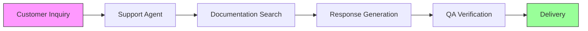

# 🤖 Multi-Agent Customer Support Automation System

[](https://www.python.org/downloads/)
[](https://github.com/joaomdmoura/crewAI)
[](https://opensource.org/licenses/MIT)
[](https://github.com/psf/black)

> An enterprise-grade customer support automation platform leveraging CrewAI's multi-agent architecture to deliver intelligent, accurate, and scalable customer service solutions.

## 📑 Table of Contents

- [🎯 Project Overview](#-project-overview)
- [🏗 System Architecture](#-system-architecture)
- [🛠 Technical Stack](#-technical-stack)
- [📦 Project Structure](#-project-structure)
- [🚀 Getting Started](#-getting-started)
- [💻 Usage Example](#-usage-example)
- [🔍 Key Features](#-key-features)
- [⚙️ Configuration](#️-configuration)
- [🧪 Testing](#-testing)
- [🤝 Contributing](#-contributing)

## 🎯 Project Overview

This system demonstrates advanced implementation of autonomous agents working in concert to handle customer inquiries, combining:
- Natural Language Processing
- Automated Documentation Search
- Quality Assurance
- Intelligent Response Generation

## 🏗 System Architecture

<details>
<summary>Click to expand architecture details</summary>

### 🤖 Core Components

1. **Support Agent**
   - Primary customer interaction
   - Technical documentation search
   - Response formulation
   - Problem resolution tracking

2. **QA Agent**
   - Response verification
   - Technical accuracy checks
   - Compliance validation
   - Communication standards enforcement

### 🔧 Support Tools

- **DocumentScraper**
  - Automated documentation search
  - Retry mechanism with exponential backoff
  - Error handling and logging
  - BeautifulSoup parsing
</details>

## 🛠 Technical Stack

<details>
<summary>View complete technical stack</summary>

- **Framework**: CrewAI
- **Language**: Python 3.8+
- **Key Dependencies**:
  - crewai==0.1.0
  - openai==1.0.0
  - beautifulsoup4==4.12.0
  - requests==2.31.0
- **Development Tools**:
  - pytest==7.4.0
  - black==23.9.1
  - flake8==6.1.0
</details>

## 📦 Project Structure

<details>
<summary>Explore project structure</summary>

```
MultiAgentCustomerSupportAutomation/
├── src/
│   ├── agents/
│   │   ├── support_agent.py    # Primary support agent
│   │   └── qa_agent.py         # Quality assurance agent
│   ├── tools/
│   │   └── scraping.py         # Documentation scraping tool
│   ├── config/
│   │   └── settings.py         # System configuration
│   └── main.py                 # Application entry point
├── setup.py                    # Package configuration
└── requirements.txt           # Dependencies
```
</details>

## 🚀 Getting Started

### Prerequisites
- Python 3.8 or higher
- OpenAI API key
- Serper API key

### Installation

<details>
<summary>Step-by-step installation guide</summary>

1. Clone the repository:
```bash
git clone
cd MultiAgentCustomerSupportAutomation
```

2. Create virtual environment:
```bash
python -m venv venv
source venv/bin/activate  # Windows: venv\Scripts\activate
```

3. Install dependencies:
```bash
pip install -r requirements.txt
```

4. Configure environment:
```bash
# Create .env file with:
OPENAI_API_KEY=your_openai_api_key
SERPER_API_KEY=your_serper_api_key
LOG_LEVEL=INFO
```
</details>

## 💻 Usage Example

<details>
<summary>View usage example code</summary>

```python
from src.main import CustomerSupportSystem

system = CustomerSupportSystem()

# Handle customer inquiry
response = system.handle_inquiry(
    customer_info={
        "name": "John Doe",
        "id": "12345",
        "priority": "high"
    },
    inquiry="How do I implement websocket connections?"
)
```
</details>

## 🔍 Key Features

### 🧠 Intelligent Support Automation
- Natural language inquiry processing
- Context-aware responses
- Documentation integration
- Automated follow-up
- **Conversation Memory:** Implemented in `src/agents/support_agent.py` and `src/conversation_memory.py` to maintain short-term memory of recent messages, enhancing context awareness.

### ✅ Quality Assurance
- Response accuracy verification
- Technical correctness validation
- Communication standards compliance
- Completeness checks
- **Expanded QA Checks:** Implemented in `src/agents/qa_agent.py`, including relevance scoring and domain-specific checks for improved accuracy.
- **User Feedback Loops:** Integrated in `src/agents/qa_agent.py` to automatically refine answers based on user feedback.

### 🛡️ Robust Error Handling
- Retry mechanisms
- Graceful degradation
- Comprehensive logging
- Exception management
- **Fallback/Escalation Options:** Implemented in `src/controllers/ticket_controller.py` to route inquiries to a human operator or advanced QA pipeline if the agent cannot find an answer within a certain number of attempts or confidence level.

### ⚙️ Configuration Management
- Environment-based settings
- Company information customization
- Model parameter tuning
- Logging level control

## 🔄 Process Flow



## 📊 Response Format

<details>
<summary>View response structure</summary>

```python
{
    "response": {
        "answer": str,
        "documentation_references": List[str],
        "confidence_score": float,
        "qa_verified": bool
    },
    "metadata": {
        "processing_time": float,
        "agent_interactions": int,
        "search_results": List[Dict]
    }
}
```
</details>

## 🚀 Production Considerations

<details>
<summary>View production checklist</summary>

- Implement rate limiting
- Add response caching
- Set up monitoring
- Configure error alerts
- Implement backup systems
</details>

## ⚙️ Configuration

<details>
<summary>View configuration options</summary>

### Agent Configuration
```python
OPENAI_MODEL = {
    "model": "gpt-3.5-turbo",
    "temperature": 0.7,
    "max_tokens": 1500
}
```

### Company Settings
```python
COMPANY_INFO = {
    "name": "YourCompany",
    "docs_url": "https://docs.yourcompany.com",
    "support_email": "support@yourcompany.com"
}
```
</details>

## 🧪 Testing

<details>
<summary>View testing commands</summary>

```bash
# Run tests
pytest

# Format code
black .

# Check style
flake8
```
</details>

## 🤝 Contributing

We welcome contributions! Please see our [Contributing Guidelines](CONTRIBUTING.md) for details.

## 📝 License

This project is licensed under the MIT License.

---

<div align="center">
  <sub>Built with ❤️ using CrewAI</sub>
</div>