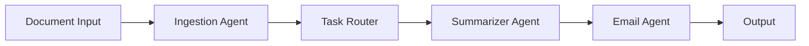

# 🤖 Multi-Agent Document Processing System

A sophisticated document processing pipeline built from scratch, implementing a modular multi-agent architecture for document ingestion, summarization, and communication.


## 🌟 Features

### 📑 Document Processing
- **Multi-format Support**: PDF, DOCX, TXT, HTML, EPUB
- **Streaming Processing**: Efficient handling of large documents
- **Metadata Extraction**: Comprehensive file analysis
- **MIME Detection**: Accurate file type identification

### 🔄 Agent System
- **Document Ingestion Agent**: Handles document parsing and text extraction
- **Summarizer Agent**: OpenAI-powered content summarization
- **Email Agent**: Automated communication
- **Task Router**: Intelligent task orchestration

### 🛠 Technical Highlights
- Async/await pattern for non-blocking operations
- Structured logging with JSON formatting
- Comprehensive error handling and retry mechanisms
- Caching system for optimization
- Docker containerization
- Environment-based configuration

## 🚀 Getting Started

### Prerequisites
```bash
python -v >= 3.9
docker (optional)
```

### Installation

1. **Clone the repository**
```bash
git clone <repository-url>
cd from-scratch
```

2. **Set up environment**
```bash
python -m venv venv
source venv/bin/activate  # Linux/Mac
# or
.\venv\Scripts\activate  # Windows
```

3. **Install dependencies**
```bash
pip install -r requirements.txt
```

4. **Configure environment**
```bash
cp .env.example .env
# Edit .env with your configuration
```

## 🔧 Configuration

### Required Environment Variables
```ini
OPENAI_API_KEY=your-api-key
DATABASE_URL=your-db-url
DEBUG=False
SECRET_MANAGER=local
```

## 🏃‍♂️ Running the System

### Local Development
```bash
python main.py
```

### Docker Deployment
```bash
docker-compose up --build
```

## 📋 API Documentation

### Document Processing Pipeline
```python
from agents import DocumentIngestionAgent, SummarizerAgent, EmailAgent

# Process a document
doc_agent = DocumentIngestionAgent()
result = doc_agent.process("path/to/document.pdf")
```

## 🧪 Testing

Run the test suite:
```bash
pytest tests/
```

### Test Coverage
- Unit Tests
- Integration Tests
- Chaos Testing
- Performance Testing

## 🏗 Architecture



## 🔍 Monitoring & Logging

### Structured Logging
```json
{
    "timestamp": "2024-02-09T10:00:00",
    "level": "INFO",
    "message": "Document processed",
    "module": "doc_ingest_agent",
    "request_id": "123"
}
```

## 🛡 Security

- Content moderation checks
- File validation
- Secure API key handling
- Docker security constraints

## ⚡ Performance

- Streaming for large files
- Caching mechanism
- Async processing
- Resource limits

## 🔄 CI/CD

- Automated testing
- Docker builds
- Health checks
- Resource monitoring

## 📈 Roadmap

- [ ] Add support for additional document formats
- [ ] Implement advanced caching strategies
- [ ] Add real-time processing status updates
- [ ] Enhance error recovery mechanisms
- [ ] Implement advanced analytics

## 🤝 Contributing

1. Fork the repository
2. Create a feature branch
3. Commit changes
4. Push to the branch
5. Open a Pull Request

## 📄 License

This project is licensed under the MIT License - see the [LICENSE](LICENSE) file for details.

## 🙏 Acknowledgments

- OpenAI for GPT API
- Python community for excellent libraries
- Docker for containerization support

